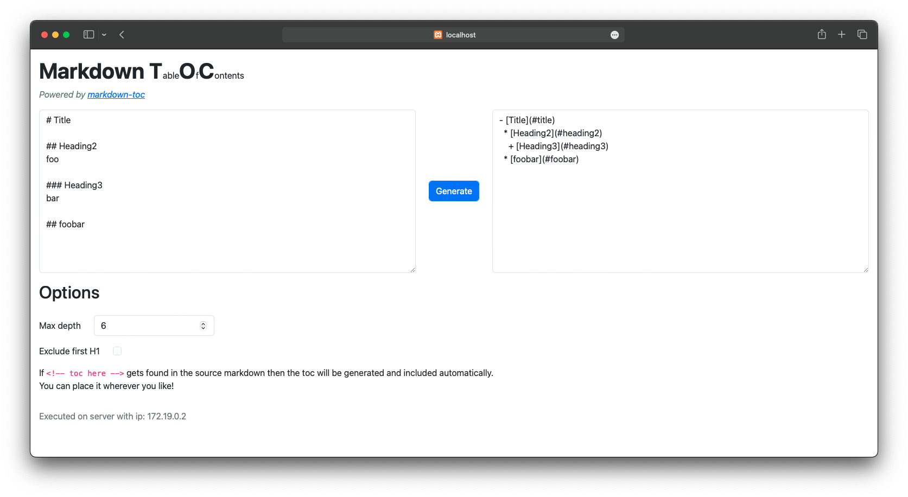

# Markdown TOC Online

Markdown TOC Online permette di generare la *table of contents* di un file scritto in Markdown.

E' possibile fruire del servizio sia attraverso una pagina web che attraverso una web API.



- [Obiettivi](#obiettivi)
- [I servizi in gioco](#i-servizi-in-gioco)
- [Predisposizione alla containerizzazione](#predisposizione-alla-containerizzazione)
  * [Parametrizzazione](#parametrizzazione)
- [Creazione delle immagini](#creazione-delle-immagini)
- [I file di configurazione per Kubernetes](#i-file-di-configurazione-per-kubernetes)
  * [Risoluzione dei nomi](#risoluzione-dei-nomi)
  * [Horizontal Pod Autoscaler](#horizontal-pod-autoscaler)
- [Testing su minikube](#testing-su-minikube)
- [Distribuzione in cloud](#distribuzione-in-cloud)
- [Terraform](#terraform)
- [I file di configurazione per Terraform](#i-file-di-configurazione-per-terraform)
- [Testing su cloud (Azure)](#testing-su-cloud-azure)
  * [Autenticarsi ad Azure](#autenticarsi-ad-azure)
  * [Creazione dell'infrastruttura (Terraform)](#creazione-dellinfrastruttura-terraform)
  * [Creazione dei servizi nel cluster](#creazione-dei-servizi-nel-cluster)

## Obiettivi

Con questo progetto si vuole dispiegare due servizi all'interno di un cluster Kubernetes in cloud.

Si vuole creare una configurazione tale da permettere ai servizi di scalare in base al carico di lavoro.

Inoltre per la gestione dell'infrastruttura e delle risorse in cloud si vuole utilizzare Terraform in quanto permette di configurare le nostre risorse in maniera dichiarativa e quindi riducendone la complessità.


## I servizi in gioco

I servizi da dispiegare sono due:
- markdown-toc (l'API web)
- markdown-toc-frontend (il frontend web)

L'API web deve essere esposta su internet.

Il frontend è solo un altro modo di fruire dell'API web, in questo modo la logica applicativa non è duplicata.

<!-- TODO: immagine architettura -->
## Predisposizione alla containerizzazione

### Parametrizzazione
Siccome il codice dei servizi, una volta containerizzato, potrà essere eseguito in situazioni molto diverse è fondamentale utilizzare delle variabili d'ambiente per permetterne la parametrizzazione.

Ad esempio, il frontend ha la necessità di contattare l'API web ma non può sapere in anticipo l'indirizzo di quest'ultima.
Per questo nel [codice](./markdown-toc-frontend/serve/index.php#L14) si sono utilizzate due variabili d'ambiente per l'host e per la porta da utilizzare:

```php
$host = gethostbyname(getenv("BACKEND_HOST"));
$port = getenv("BACKEND_PORT");
$url = "http://".$host.":".$port."/markdown-toc.php";
```

Nel [Dockerfile](./markdown-toc-frontend/Dockerfile) sono state settate con dei valori di default (che sono stati scelti appositamente per quando poi andremo a dispiegare il container all'interno di Kubernetes):

<h4 id="dockerfile-env" style="visibility: hidden;"></h4>

```Dockerfile
ENV BACKEND_HOST markdown-toc
ENV BACKEND_PORT 80
```

## Creazione delle immagini

Assumendo di trovarsi nella cartella radice di questa repository, i comandi per costruire le immagini dei due servizi sono i seguenti:

```sh
docker build -t markdown-toc ./markdown-toc
docker build -t markdown-toc-frontend ./markdown-toc-frontend
```

## I file di configurazione per Kubernetes
Sia per l'API web che per il frontend vogliamo creare:
- un *Deployment*, nel quale definiremo le immagini da utilizzare per i pod e altre configurazioni
- un *Service* che fungerà da punto di accesso unico ai pod e ne bilancerà il carico
- un *Horizontal Pod Autoscaler* che farà in modo di aumentare o diminuire il numero di pod in base al carico di lavoro

Service e Deployment dell'API web: [markdown-toc.yaml](./markdown-toc.yaml)

Service e Deployment del frontend: [markdown-toc-frontend.yaml](./markdown-toc-frontend.yaml)

> **Nota**
>
> In realtà all'interno dei file di configurazione, non sono indicate le immagini docker che sono appena state create.
> Sono invece indicate le due immagini caricate da me su Docker hub.
>
> Questo è dovuto al fatto che minikube non si connette al Docker registry sull'host ma ne ha uno al suo interno e, sebbene [sarebbe possibile](https://medium.com/swlh/how-to-run-locally-built-docker-images-in-kubernetes-b28fbc32cc1d) "inviare" a minikube le immagini appena costruite, questo non sarebbe altrettanto semplice per quando poi si andrà ad utilizzare un cloud provider.

### Risoluzione dei nomi
La cosa fondamentale è fare attenzione al nome che daremo ai due Service perchè ci permetterà di sfruttare il sistema DNS interno al cluster per permettere la comunicazione tra i due diversi pod.

Infatti si è scelto *markdown-toc* come nome del Service dell'API così che coincida con il valore di default che [abbiamo settato](#dockerfile-env) nel Dockerfile del frontend.

```yaml
# markdown-toc.yaml
apiVersion: v1
kind: Service
metadata:
  name: markdown-toc # <-----
  labels:
    app: markdown-toc-app
# ...
```

### Horizontal Pod Autoscaler

I file [markdown-toc-hpa.yaml](./markdown-toc-hpa.yaml) e [markdown-toc-frontend-hpa.yaml](./markdown-toc-frontend-hpa.yaml) definiscono gli Horizontal Pod Autoscaler per entrambi i Service.

Sono quasi identici nella sostanza, per i dettagli della configurazione si leggano i commenti in [markdown-toc-hpa.yaml](./markdown-toc-hpa.yaml).

## Testing su minikube

Per prima cosa facciamo partire minikube e poi installiamo il metric server (necessario per l'Horizontal Pod Autoscaling):
```sh
minikube start
minikube addons enable metrics-server
```

<!-- Per utilizzare i service di tipo LoadBalancer è [necessario](https://minikube.sigs.k8s.io/docs/handbook/accessing/#loadbalancer-access) utilizzare minikube tunnel.
(Consiglio di aprire un termiale separato in quanto il tunnel andrà lasciato in esecuzione)
```sh
minikube tunnel
``` -->

Ora sempre dalla cartella radice della repository instanziamo i deployment e i service:
```sh
kubectl apply -f ./markdown-toc.yaml
kubectl apply -f ./markdown-toc-frontend.yaml
```

Adesso testiamo che i pod e i service funzionino.

Testiamo il backend:
```sh
curl --location "$(minikube service --url markdown-toc)/markdown-toc.php" \
--header 'Content-Type: application/json' \
--data '{
    "md-text": "# Title\r\n\r\n<!-- toc here -->\r\n\r\n## Heading2\r\nfoo\r\n\r\n### Heading3\r\nbar\r\n\r\n## foobar"
}'
```

Testiamo il frontend:
```sh
minikube service markdown-toc-frontend
```

Si noti che quando viene generata la table of contents viene anche restituito un indirizzo ip. Quello è l'indirizzo (interno al cluster) del pod che ha eseguito la richiesta.

Questo ci permette di osservare che il LoadBalancer sta distribuendo il carico tra i pod, infatti effettuando più volte la richiesta l'indirizzo in questione cambia.

Ora attiviamo gli Horizontal Pod Autoscaler:
```sh
kubectl apply -f ./markdown-toc-hpa.yaml
kubectl apply -f ./markdown-toc-frontend-hpa.yaml
```

E in un altro terminale eseguiamo:
```sh
kubectl get hpa --watch

# NAME                        REFERENCE                          TARGETS         MINPODS   MAXPODS   REPLICAS   AGE
# markdown-toc-frontend-hpa   Deployment/markdown-toc-frontend   <unknown>/50%   1         10        0          8s
# markdown-toc-hpa            Deployment/markdown-toc            <unknown>/50%   1         10        0          9s

# markdown-toc-frontend-hpa   Deployment/markdown-toc-frontend   10%/50%         1         10        2          15s
# markdown-toc-hpa            Deployment/markdown-toc            0%/50%          1         10        2          16s

# markdown-toc-frontend-hpa   Deployment/markdown-toc-frontend   10%/50%         1         10        2          45s
# markdown-toc-hpa            Deployment/markdown-toc            0%/50%          1         10        2          46s

# markdown-toc-frontend-hpa   Deployment/markdown-toc-frontend   10%/50%         1         10        1          60s
# markdown-toc-hpa            Deployment/markdown-toc            0%/50%          1         10        1          61s
```

E' normale che ci voglia più o meno tempo prima che l'hpa riesca ad ottenere le metriche dai deployment, questo è il motivo per cui si vede *\<unknown\>* nelle prime due righe.

Inizialmente le repliche sono due, come definito dal deployment nei file di configurazione yaml.

Poco dopo vediamo che le repliche calano a 1, questo succede in quanto il carico è inferiore al target e quindi l'hpa scala verso il basso il numero di pod.

Adesso testiamo anche che i pod possano scalare verso l'alto. Per farlo genereremo del carico con lo script workload.sh (carica di lavoro solo l'API web non il frontend):
```sh
# il primo parametro indica l'indirizzo al quale inviare le richieste
# il secondo invece l'intervallo di tempo in secondi tra una richiesta e l'altra

./workload.sh "$(minikube service --url markdown-toc)" 1.5
```

Continiuamo ad osservare gli hpa e noteremo che dopo poco tempo da quanto il carico è incrementato il numero di repliche torna a salire:
```sh
kubectl get hpa --watch

# NAME                        REFERENCE                          TARGETS   MINPODS   MAXPODS   REPLICAS   AGE
# markdown-toc-hpa            Deployment/markdown-toc            0%/50%    1         10        1          10m
# markdown-toc-hpa            Deployment/markdown-toc            57%/50%   1         10        1          11m
# markdown-toc-hpa            Deployment/markdown-toc            57%/50%   1         10        2          11m
# markdown-toc-hpa            Deployment/markdown-toc            36%/50%   1         10        2          12m
```

Interrompiamo il carico di workload.sh con `^C`

Puliamo il cluster minikube e stoppiamolo:
```sh
kubectl delete \
-f markdown-toc-hpa.yaml \
-f markdown-toc-frontend-hpa.yaml \
-f markdown-toc.yaml \
-f markdown-toc-frontend.yaml

minikube stop
```

Adesso che abbiamo testato il funzionamento del nostro cluster su minikube possiamo prepararci a dispiegarlo su un cloud provider.

## Distribuzione in cloud
Come provider cloud si è scelto Azure in quanto forniva un credito iniziale generoso e vantava un gran quantitativo di documentazione ed esempi.

Il fatto di distribuire markdown-toc su un cloud provider fornisce anche la possibilità di attivare il cluster autoscaling di kubernetes. Questo permette a kubernetes di instanizare nuovi nodi in caso di necessità o rimuoverne quando il carico di lavoro lo permette.

Il cluster autoscaling è fondamentale per ridurre il costo in quanto questo deriva dal numero di nodi (macchine virtuali) attivi, a prescindere dal fatto che essi siano sotto carico o meno.

## Terraform
Si è deciso di sperimentare l'utilizzo di Terraform.

Questo strumento consente di definire in modo dichiarativo l'infrastruttura e le risorse del cloud provider che si vogliono utilizzare.

Il fatto di definire l'infrastruttura come codice fornisce diversi vantaggi e possibilità, come ad esempio effettuarne il versioning.
Inoltre si è riscontrato che, sebbene richieda la lettura di un po' di documentazione, l'utilizzo di Terraform risulta molto più semplice e veloce rispetto all'interfaccia standard di Azure.

Sebbene Terraform dia la possibilità di gestire anche le risorse di Kuberenetes (come pod, deployment, ecc..) attraverso l'uso del [provider Kubernetes](https://registry.terraform.io/providers/hashicorp/kubernetes/latest/docs), si è scelto di non sfruttarlo in modo da utilizzare la stessa configurazione (i file yaml) che è stata testata su Minikube.

## I file di configurazione per Terraform
La base dei file di configurazione è stata clonata da questo [esempio ufficiale](https://github.com/hashicorp/terraform-provider-kubernetes/tree/main/_examples/aks), poi modificata in base alle necessità e ridotta all'osso per diminuirne la complessità.

Il [file di configurazione](./terraform/main.tf) è completo di commenti che spiegano ogni dettaglio.

Verranno creati:
- un gruppo di risorse
- un cluster AKS
- una copia locale del file di configurazione del cluster Kubernetes (per potersi connettere al cluster utilizzando `kubectl`)

## Testing su cloud (Azure)

### Autenticarsi ad Azure
Per poter utilizzare Terraform è necessario essere autenticati ad Azure. Per farlo si consiglia di installare la CLI di Azure:

```sh
sudo apt install azure-cli
```

Lanciando questo comando verrà aperta una finestra del browser dove fare login con il proprio account Microsoft:
```sh
az login
```

Da adesso si è autenticati, Terraform sfrutterà in automatico questa sessione.

### Creazione dell'infrastruttura (Terraform)

Installare Terraform:
```sh
sudo apt install terraform
```

Spostarsi nella cartella terraform:
```sh
cd terraform
```

Creiamo l'infrastruttura sul cloud provider:
```sh
terraform apply

# Terraform used the selected providers to generate the following execution plan. Resource actions are indicated with the following symbols:
#   + create

# Terraform will perform the following actions:

#   # azurerm_kubernetes_cluster.default will be created
#   + resource "azurerm_kubernetes_cluster" "default" {
#       + api_server_authorized_ip_ranges     = (known after apply)
#       + dns_prefix                          = "markdown-toc-online"
#       + fqdn                                = (known after apply)
#       + http_application_routing_zone_name  = (known after apply)
#       + id                                  = (known after apply)
#       + image_cleaner_enabled               = false
#       + image_cleaner_interval_hours        = 48
#       + kube_admin_config                   = (sensitive value)
#       + kube_admin_config_raw               = (sensitive value)
#       + kube_config                         = (sensitive value)
#       + kube_config_raw                     = (sensitive value)
#       + kubernetes_version                  = (known after apply)
#       + location                            = "westeurope"
#       + name                                = "markdown-toc-online"
#       + node_resource_group                 = (known after apply)
#       + node_resource_group_id              = (known after apply)
#       + oidc_issuer_url                     = (known after apply)
#       + portal_fqdn                         = (known after apply)
#       + private_cluster_enabled             = false
#       + private_cluster_public_fqdn_enabled = false
#       + private_dns_zone_id                 = (known after apply)
#       + private_fqdn                        = (known after apply)
#       + public_network_access_enabled       = true
#       + resource_group_name                 = "markdown-toc-online"
#       + role_based_access_control_enabled   = true
#       + run_command_enabled                 = true
#       + sku_tier                            = "Free"
#       + workload_identity_enabled           = false

#       + default_node_pool {
#           + enable_auto_scaling  = true
#           + kubelet_disk_type    = (known after apply)
#           + max_count            = 5
#           + max_pods             = (known after apply)
#           + min_count            = 1
#           + name                 = "pool0"
#           + node_count           = (known after apply)
#           + node_labels          = (known after apply)
#           + orchestrator_version = (known after apply)
#           + os_disk_size_gb      = (known after apply)
#           + os_disk_type         = "Managed"
#           + os_sku               = (known after apply)
#           + scale_down_mode      = "Delete"
#           + type                 = "VirtualMachineScaleSets"
#           + ultra_ssd_enabled    = false
#           + vm_size              = "Standard_A2_v2"
#           + workload_runtime     = (known after apply)
#         }

#       + identity {
#           + principal_id = (known after apply)
#           + tenant_id    = (known after apply)
#           + type         = "SystemAssigned"
#         }
#     }

#   # azurerm_resource_group.default will be created
#   + resource "azurerm_resource_group" "default" {
#       + id       = (known after apply)
#       + location = "westeurope"
#       + name     = "markdown-toc-online"
#     }

#   # local_file.kubeconfig will be created
#   + resource "local_file" "kubeconfig" {
#       + content              = (sensitive value)
#       + content_base64sha256 = (known after apply)
#       + content_base64sha512 = (known after apply)
#       + content_md5          = (known after apply)
#       + content_sha1         = (known after apply)
#       + content_sha256       = (known after apply)
#       + content_sha512       = (known after apply)
#       + directory_permission = "0777"
#       + file_permission      = "0777"
#       + filename             = "./outputs/kubeconfig"
#       + id                   = (known after apply)
#     }

# Plan: 3 to add, 0 to change, 0 to destroy.

# Changes to Outputs:
#   + kubeconfig_path    = "/Users/Alessandro/Desktop/Terranetes Project/terraform/outputs/kubeconfig"

# Do you want to perform these actions?
#   Terraform will perform the actions described above.
#   Only 'yes' will be accepted to approve.

#   Enter a value:
```

Se si è soddisfatti delle operazioni che verranno eseguite inserire `yes`.

Una volta termina la creazione delle risorse (ci potrebbero volere anche 5 minuti), andiamo a settare la variabile d'ambiente `$KUBECONFIG` che indica il percorso al quale `kubectl` andrà a cercare il file di configurazione *kubeconfig*:
```sh
export KUBECONFIG="$(terraform output -raw kubeconfig_path)"
```

Tornare nella cartella radice del progetto:
```sh
cd ..
```

### Creazione dei servizi nel cluster
Creare deployment e service di markdown-toc e markdown-toc-frontend:
```sh
kubectl apply -f markdown-toc.yaml
kubectl apply -f markdown-toc-frontend.yaml
```

Per verificare che i pod siano stati instanziati è possibile utilizzare:
```sh
kubectl get pods

# NAME                                     READY   STATUS    RESTARTS   AGE
# markdown-toc-fd65d6f89-69hff             1/1     Running   0          60m
# markdown-toc-fd65d6f89-pmrrv             1/1     Running   0          60m
# markdown-toc-frontend-57f9b58fdc-8cghq   1/1     Running   0          60m
# markdown-toc-frontend-57f9b58fdc-qplfp   1/1     Running   0          60m
```

Ora possiamo testare il funzionamento dei service e dei pod come abbiamo fatto con Minikube.

Testiamo il backend:
```sh
curl --location "$(kubectl get service markdown-toc -o jsonpath="{.status.loadBalancer.ingress[0].ip}")/markdown-toc.php" \
--header 'Content-Type: application/json' \
--data '{
    "md-text": "# Title\r\n\r\n<!-- toc here -->\r\n\r\n## Heading2\r\nfoo\r\n\r\n### Heading3\r\nbar\r\n\r\n## foobar"
}'
```

Per testare il frontend aprire il link generato dal seguente script:
```sh
echo "http://$(kubectl get service markdown-toc-frontend -o jsonpath="{.status.loadBalancer.ingress[0].ip}")/index.php"
```
Ora attiviamo gli Horizontal Pod Autoscaler:
```sh
kubectl apply -f ./markdown-toc-hpa.yaml
kubectl apply -f ./markdown-toc-frontend-hpa.yaml
```

E in un altro terminale eseguiamo:
```sh
# Se si è aperta una nuova shell è necessario settare nuovamente la variabile d'ambiente..
cd terraform
export KUBECONFIG="$(terraform output -raw kubeconfig_path)"
cd ..

kubectl get hpa --watch

# NAME                        REFERENCE                          TARGETS   MINPODS   MAXPODS   REPLICAS   AGE
# markdown-toc-frontend-hpa   Deployment/markdown-toc-frontend   10%/50%   1         10        1          2m13s
# markdown-toc-hpa            Deployment/markdown-toc            0%/50%    1         10        1          2m13s
```

Adesso testiamo anche che i pod possano scalare verso l'alto. Per farlo genereremo del carico con lo script workload.sh (carica di lavoro solo l'API web non il frontend):
```sh
# il primo parametro indica l'indirizzo al quale inviare le richieste
# il secondo invece l'intervallo di tempo in secondi tra una richiesta e l'altra

./workload.sh "http://$(kubectl get service markdown-toc -o jsonpath="{.status.loadBalancer.ingress[0].ip}")" 1.5
```

Continiuamo ad osservare gli hpa e noteremo che dopo poco tempo da quando il carico è incrementato il numero di repliche torna a salire:
```sh
kubectl get hpa --watch

# NAME                        REFERENCE                          TARGETS   MINPODS   MAXPODS   REPLICAS   AGE
# markdown-toc-hpa            Deployment/markdown-toc            0%/50%    1         10        1          9m31s
# markdown-toc-hpa            Deployment/markdown-toc            6%/50%    1         10        1          23m
# markdown-toc-hpa            Deployment/markdown-toc            46%/50%   1         10        1          24m
# markdown-toc-hpa            Deployment/markdown-toc            60%/50%   1         10        1          25m
# markdown-toc-hpa            Deployment/markdown-toc            60%/50%   1         10        2          25m
# markdown-toc-hpa            Deployment/markdown-toc            59%/50%   1         10        2          25m
```

Interrompiamo il carico di workload.sh con `^C`

Adesso rimane da testare solo il cluster autoscaling.
Per riuscire a farlo entrare in gioco la cosa più semplice è andare ad aumentare la richiesta minima di cpu dei pod in modo tale che Kubernetes non possa instanziarne troppi nello stesso nodo e debba quindi crearne uno nuovo.

Modificare quindi questo valore nel file [markdown-toc.yaml](./markdown-toc.yaml):
```yaml
# ...
    spec:
      containers:
      - name: markdown-toc
        image: ventus218/markdown-toc
        ports:
        - containerPort: 80
        resources:
          requests:
            cpu: 10m # <--- impostare a 500m
          limits:
            cpu: 500m
```

Applicare le modifiche:
```sh
kubectl apply -f markdown-toc.yaml
```

Generare il carico:

```sh
# il primo parametro indica l'indirizzo al quale inviare le richieste
# il secondo invece l'intervallo di tempo in secondi tra una richiesta e l'altra

./workload.sh "http://$(kubectl get service markdown-toc -o jsonpath="{.status.loadBalancer.ingress[0].ip}")" 1
```

Aprire un terminale in cui osservare i nodi del cluster:
```sh
# Se si è aperta una nuova shell è necessario settare nuovamente la variabile d'ambiente..
cd terraform
export KUBECONFIG="$(terraform output -raw kubeconfig_path)"
cd ..

kubectl get nodes --watch

# NAME                            STATUS   ROLES   AGE    VERSION
# aks-pool0-42340198-vmss000000   Ready    agent   128m   v1.25.6
# aks-pool0-42340198-vmss000000   Ready    agent   128m   v1.25.6
# aks-pool0-42340198-vmss000001   NotReady   <none>   0s     v1.25.6
# aks-pool0-42340198-vmss000001   NotReady   <none>   1s     v1.25.6
# aks-pool0-42340198-vmss000001   NotReady   <none>   1s     v1.25.6
# aks-pool0-42340198-vmss000001   NotReady   <none>   1s     v1.25.6
# aks-pool0-42340198-vmss000001   NotReady   <none>   2s     v1.25.6
# aks-pool0-42340198-vmss000001   Ready      <none>   11s    v1.25.6
```

Si può notare come sia stato instanziato un altro nodo (quello con l'*1* alla fine del nome).

Interrompere il carico di workload.sh con `^C`. Si noti che senza modificare le impostazioni di Azure passeranno circa 20 minuti prima che un nodo venga distrutto in automatico dopo che il carico è calato.

Eliminiamo il cluster e le risorse create su Azure:
```sh
cd terraform
terraform destory
cd ..
```
